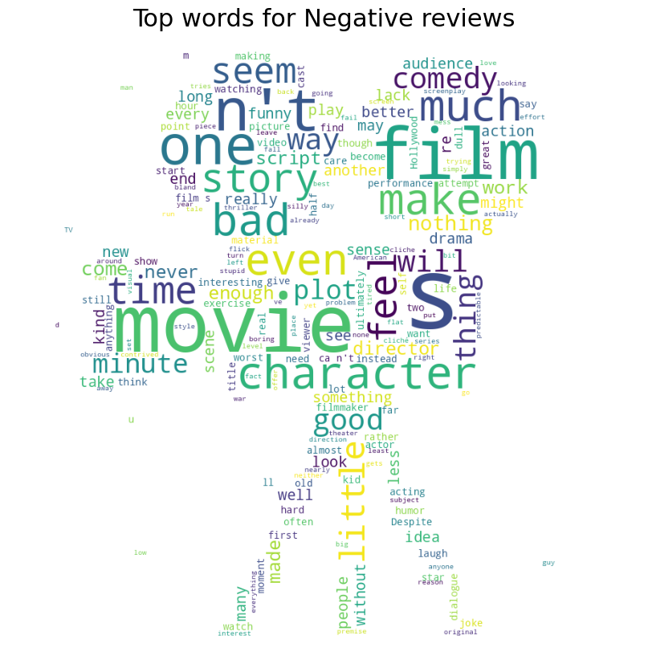

# Classifying Movie Reviews

## Content
1. Introduction
2. Repo Structure
3. Instructions
4. Exploratory Analysis
5. Comparing Results

## 1. Introduction
This repo uses machine learning and deep learning models to predict the sentiment of movie reviews as being 'Postive' or 'Negative'. The following sections detail how to use the code for new data, as well as showing how the selected models have performed on the code they were trained on.

## 2. Repo Structure
```text
├── code
|  └── front_end.ipynb
|  └── parent_dir.py　　
|  └── model_loader.py　　　
|  └── preprocess_text.py　　　　
|  └── predict_text.py
|  └── display_results.py
|  └── requirements.txt
|  └── README.md
├── data
|  └── test_sample.csv
|  └── README.md
├── images
|  └── neg_wordcloud.png
|  └── pos_wordcloud.png
├── models
|  └── model_conv.h5
|  └── model_glove.h5
|  └── model_bert.h5
|  └── README.md
├── assignment3_Part1_3_hs3458_kem2231.ipynb
├── assignment3_Part2_3_hs3458_kem2231.ipynb
├── README.md
```
## 3. Instructions

Clone the repository locally. Upload any new text data to predict on to "data" folder. In the "code" folder, open front_end.ipynb. Uncomment and run the first line in order to install required packages. In the indicated space, input the model on which you want to run the inference pipeline on your data. The model choices are as follows;

model_conv: CNN model with Conv1D layers   
model_glove: Transfer learning model with GloVe embeddings   
model_bert: BERT model   

(Model training results are summarized further below.)

Unfortunately, the only model that is able to be loaded currently is model_conv. model_glove causes to the environment to crash, and model_bert requires modifications to the model loading function that incorporates definitions for custom layers, which we did not have the time to implement.

## 4. Exploratory Analysis
From the data analysis, we learned that the class balance was about even, at 52.17% positive, 47.83% negative. Additionally, both classes have a very similar distribution regarding review length. However, below the wordclouds show that there are differences in what the most common words in each set of data are.



## 5. Comparing Results
The table below shows a strong trend of accuracy improving as the model number increased. This makes sense, because as we continued training, our models became more comlpex, and, so, better able to understand and predict on the data. Alongside accuracy, loss also mostly improves by decreasing. our best model was bert, but all the transfer models performed strongly.

|Model | Accuracy  |  Loss|
|:-:|:-:|:-:|
|mod1 |  0.65101 | 1.1529|
|mod2 |  0.72399 | 1.2366|
|tuner |  0.75361 | 0.5703|
|conv  | 0.74711 | 0.7456|
|glove |  0.80347 | 0.4863|
|bert |  0.84682 | 0.5296|
